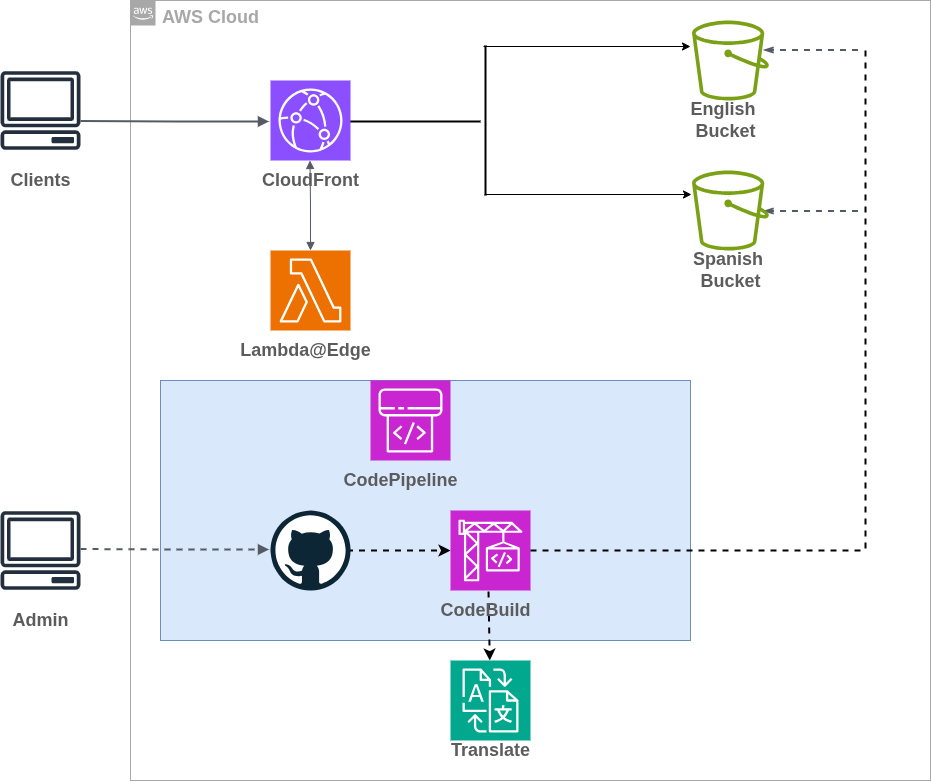
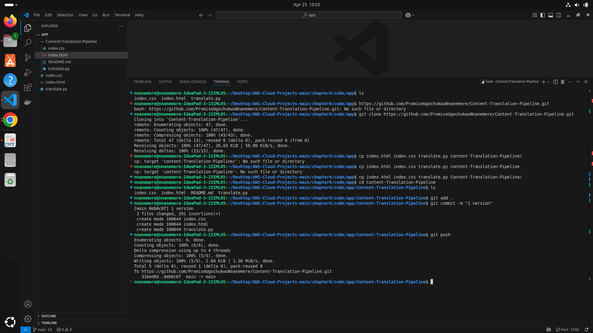
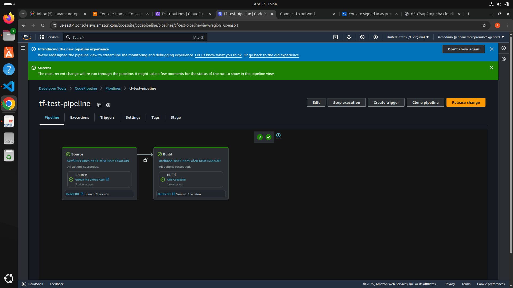
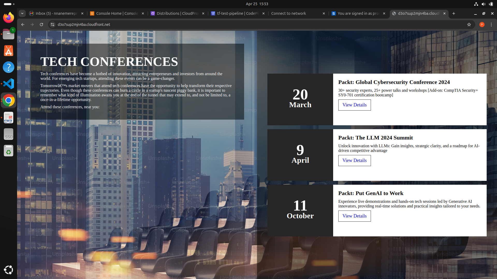

# 🌐 Multilingual Web App with Edge Translation

A multilingual static web app built with AWS services and deployed through a fully automated CI/CD pipeline. It dynamically translates content at the edge using AWS Translate and Lambda@Edge.

---

## 📦 Features

- 🌍 Multilingual support (via Amazon Translate)
- ⚡ Edge-based translation (Lambda@Edge)
- 🚀 Continuous Integration and Deployment using AWS CodePipeline
- ☁️ Serverless architecture (S3, CloudFront, Lambda)
- 🔧 Infrastructure as Code with Terraform

---

## 🏗️ Project Structure

```bash
.
├── app/                # App source files
├── lambda/             # Lambda@Edge function code (Python)
├── images/, demo/      # Screenshots and video demonstration
├── index.html          # Entry point for web app
├── cicd.tf             # CI/CD pipeline Terraform config
├── dev.tfvars          # Terraform variables for dev env
├── infrastructure.tf   # S3, CloudFront, Lambda resources
├── variables.tf        # Input variable definitions
├── buildspec.yml       # CodeBuild instructions
└── terraform.tfstate   # Terraform state tracking

```

## 🧱 Architecture



--- 

## 🎥 Demo

| [Demo Video](demo/content_translation_pipeline.webm) | Demonstration of Content Translation Pipeline |

--- 

## 📸 Screenshots

| Preview | Description |
|--------|-------------|
|  | Auto Trigger Check |
|  | Test Pipeline |
|  | Webpage |

---

## ⚙️ How It Works

1. **Hosting the Web App**

- Static files are stored in Amazon S3.
- Distributed globally using CloudFront.

2. **Multilingual Support**

- Lambda@Edge intercepts requests and translates content using Amazon Translate.
- Language is inferred from headers or user preference.

3. **CI/CD Pipeline**

- Configured via Terraform and buildspec.yml.
- Automatically deploys app updates and infrastructure changes.

---

## 🚀 Getting Started

**Prerequisites**

- AWS CLI configured
- Terraform installed
- IAM permissions for S3, Lambda, CloudFront, Translate
- Node.js/Python (if modifying frontend/backend)
- Setup Instructions

--- 

**Setup Instructions**

```bash

# 1. Clone the repo
git clone https://github.com/yourusername/multilingual-webapp.git
cd multilingual-webapp

# 2. Initialize and apply Terraform
terraform init
terraform apply -var-file="dev.tfvars"

# 3. Push changes to trigger CI/CD (if pipeline is active)
git commit -am "Update web app"
git push origin main

```
---

## 🔁 Improving the App

- Implement DNS name for remembrance and security
- Add support for more languages
- Adopt CI/CD for infrastructure code
- Enable fallback translations

--- 

## 🧠 Learnings

- Using Lambda@Edge to run translation logic at global locations
- Automating infrastructure deployment using Terraform
- Integrating Translate API dynamically at runtime

---

## 🪪 License

MIT License

---

## 🙋‍♂️ Author

Promise Ugochukwu Nnanemere

[🔗 LinkedIn](https://linkedin.com/in/promiseugochukwunnanemere)
